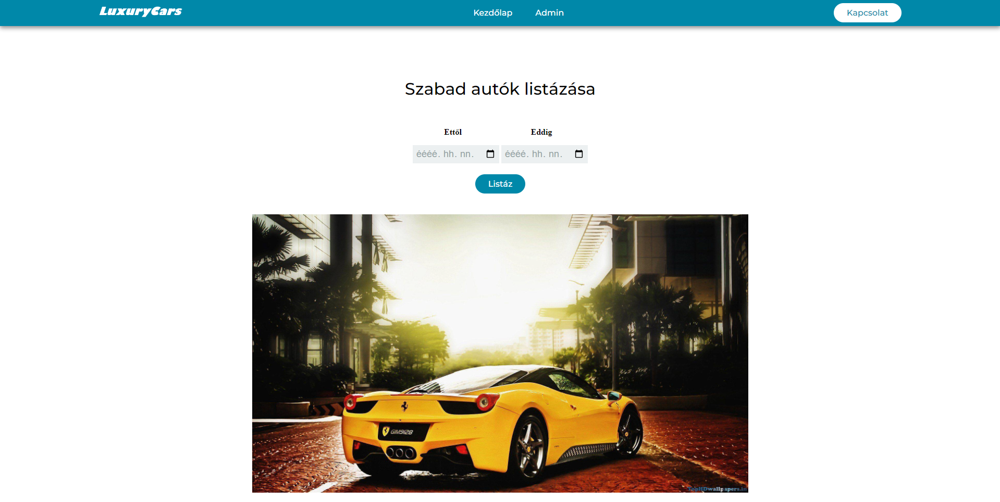

# CarRental
**Használt fejlesztői környezet:** IntelliJ IDEA<br>
**Használt technológiák:** Spring Boot, Spring Security, Jpa, Docker<br>
**Frontend:** Thymeleaf<br>
**Adatbázis engine:** PostgreSQL<br>
**Adatbázis neve:** car_rental

# Útmutató
## Projekt bekonfigurálása első használat előtt<br>
 
  1.  ```src/main/resources/application.properties``` fájlban módosíthatunk minden adatbázis eléréssel kapcsolatos információt, ha ez szükséges. Docker használata esetén ezt a ```docker-compose.yml``` fájlban is tegyük meg.
  2. Érdemes rányomni a Reload All Maven Projects gombra IntelliJ esetén
  3. mvn install
  4. Futtatás előtt létrehozni az adatbázist és a táblákat, beszúrásokat, amelyek kódjai megtalálhatóak az ```src/main/resources``` mappában. Ha nem hozzuk létre a táblákat első indítás előtt, akkor a hibernate ezt megteszi helyettünk, de érdemes nekünk lefuttatni először az sql fájlokat.  Viszont magát a ```car_rental``` nevű adatbázist muszáj létrehozni.
  5. Le lehet simán is futtatni a projektet, de maven-ből is indíthatjuk: mvn spring-boot:run
  
## Lehetőség van docker segítségével elindítani a projektet, ebben az esetben

 1. mvn install, ekkor létrejön a target mappában a car-rental-docker nevű jar fájl
 2. Itt is a fent leírt adatbázis konfigurálás
 3. Terminálon belül navigáljunk a projekt mappájába (carRental, ahol vannak a docker fájlok is)
 4. Adjuk ki a következő két parancsot a terminálon belül:<br> 
     Buildeléshez: &nbsp; ```docker build -t car-rental-docker.jar .``` <br>
     Futtatáshoz:  &nbsp;   ```docker run --net=host -p 8081:8080 -t car-rental-docker.jar``` <br>

## Egyéb információk
Ha sikerült a konfigurálás, akkor indításnál ez a kezdőlap fogad minket<br><br>
 <br>

### Röviden az weblapról:<br>
A főoldalon lehetőségünk van kiválasztani egy től-ig dátum párost és a Listáz gombra nyomva kilistázza a megadott dátumok közötti időben elérhető autókat. Ezeket az autókat letudjuk foglalni egy űrlap segítségével, és a foglalások tárolódnak az adatbázisban.<br>
Az admin oldalra kattintva megkapjuk a grant authoritiesben az admin jogokat és lehetőségünk van megtekinteni az adatbázisban szereplő autókat, amelyeket módosíthatunk, deaktiválhatunk, aktiválhatunk, törölhetünk. Deaktiválás és törlés esetén az autóhoz tartozó összes foglalás is törlésre kerül. A foglalásokat is megtekinthetjük, valamint autókat adhatunk hozzá az adatbázishoz.


